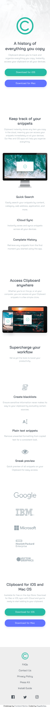
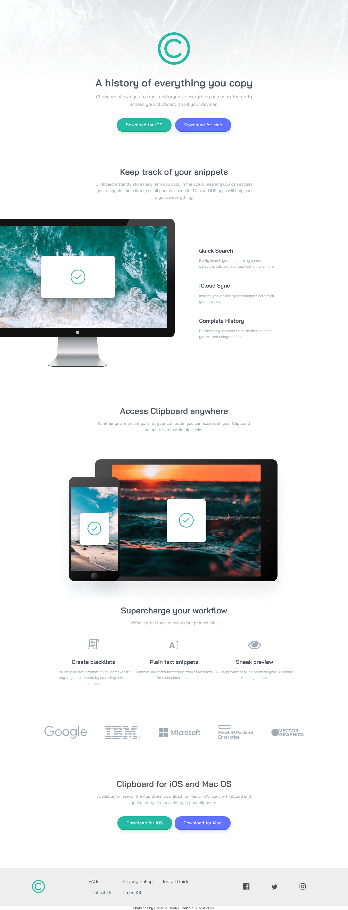

# Frontend Mentor - Clipboard landing page solution

This is a solution to the [Clipboard landing page challenge on Frontend Mentor](https://www.frontendmentor.io/challenges/clipboard-landing-page-5cc9bccd6c4c91111378ecb9). Frontend Mentor challenges help you improve your coding skills by building realistic projects.

## Table of contents

- [Overview](#overview)
- [The challenge](#the-challenge)
- [Screenshot](#screenshot)
- [Links](#links)
- [Built with](#built-with)
- [Author](#author)

## Overview

### The challenge

Users should be able to:

- View the optimal layout depending on their device's screen size.

### Screenshot

### Links

- Solution URL: [Via Frontend Mentor](https://www.frontendmentor.io/solutions/responsive-clipboard-landing-page-VPMhD_JEo)
- Live Site URL: [Via Github Pages](https://ragabogaa.github.io/clipboard-landing-page/)

### Built with

- Semantic HTML5 markup
- CSS custom properties
- Flexbox
- Mobile-first workflow

## Author

- Frontend Mentor - [@RagaBoGaa](https://www.frontendmentor.io/profile/RagaBoGaa)
